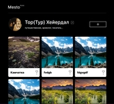
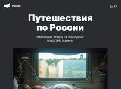
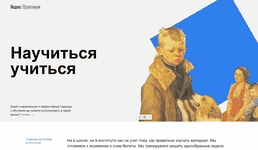

<h1 align="center"> Привет! 👋  Меня зовут Юрий.</h1>

<table align="center" width="100%" height="500">
  <tr>
    <td width="16%">
      

        
        
        
      

    </td>
    <td width="68%">
      

Я учусь на web-разработчика. 
Хочу заниматься фронтендом,  возможно в будущем не только им. 
Пока имею некоторый опыт работы со следующими технологиями:

      
  
          
          
          
          
          
          
          
        
  
         
        

Мои достижения на codewars 
          
        
  
         
        

          
        

    </td>
    <td width="16%">
      

        
          
      

    </td>  
 <tr>    
</table>  
